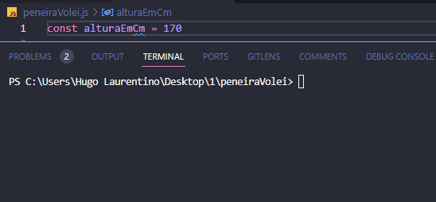

<h1 align="center">
  
</h1>

- [x] Bak-End
- [x] Criar Título
- [x] Criar Descrição
- [x] Sobre
- [x] Tecnologia
- [x] Pre requisito
- [x] Autor
- [x] GIF‘s

---
<h1 align='center'>Peneira de Vólei</h1>

<p align='center'>Esse é um exemplo de lógica em javascript</p>
<p align='center'>
 Faça um programa que, dada a altura de um determinado candidato, diga se ele está aprovado ou reprovado nessa primeira fase do processo.
 Dada a altura de um determinado candidato, diga para qual posição ele deverá fazer o teste.
</p>

<p align='center'>
 <a href='#sobre'>Sobre</a> |
 <a href='#pré-requisitos'>Pre Requisitos</a> |
 <a href='#tecnologias'>Tecnologias</a> |
 <a href='#autor'>Autor</a>
</p>

---
<h1 align='center'>
 
</h1>

---

### Sobre

  <p align= 'justify'>
  Numa "peneira" (processo seletivo para novos jogadores) de vôlei, em alguns clubes, o primeiro filtro é ver se um determinado candidato tem a altura mínima necessária de 180cm. 
  Após passar na primeira fase de uma peneira de vôlei, os candidatos aprovados são separados em grupos diferentes, de acordo com suas alturas, para serem testados para posições específicas.

- Caso o jogador tenha menos de 180cm, o programa deve imprimir **REPROVADO**
- Caso o jogador tenha mais de 180cm, o programa deve imprimir **APROVADO**
- Caso tenha entre 180cm e 185cm, o programa deve imprimir **LÍBERO**
- Caso tenha entre 186cm e 195cm, o programa deve imprimir **PONTEIRO**
- Caso tenha entre 196cm e 205cm, o programa deve imprimir **OPOSTO**
- Caso tenha mais de 205cm, o programa deve imprimir **CENTRAL**
  </p>

---

### Pré-requisitos

Antes de começar, você vai precisar ter instalado em sua máquina as seguintes FERRAMENTAS: [GIT](https://git-scm.com/), [Node.js](https://nodejs.org/en/download).
Além disto é bom ter um editor para trabalhar com o código como [VSCode](https://code.visualstudio.com/download).

### 🎲 Rodando o Back End

```bash
# Clone este repositório
$ git clone https://github.com/hugolaurentino/peneiraVolei.git

# Acesse a pasta do projeto no terminal/cmd
$ cd peneiraVolei

# Instale as dependências
$ npm install

# Execute 
$ node .\peneiraVolei.js

```
### Tecnologias

As seguintes ferramentas foram usadas na construção do projeto:

- [Node.js][nodejs]

---
###### tags: `lógica` `matemática` `nodeJS`
## Autor
Feito com ❤️ por Hugo Laurentino 👋🏽 [Entre em contato!](https://www.linkedin.com/in/hugo-laurentino-silva/)

[nodejs]: https://nodejs.org/
